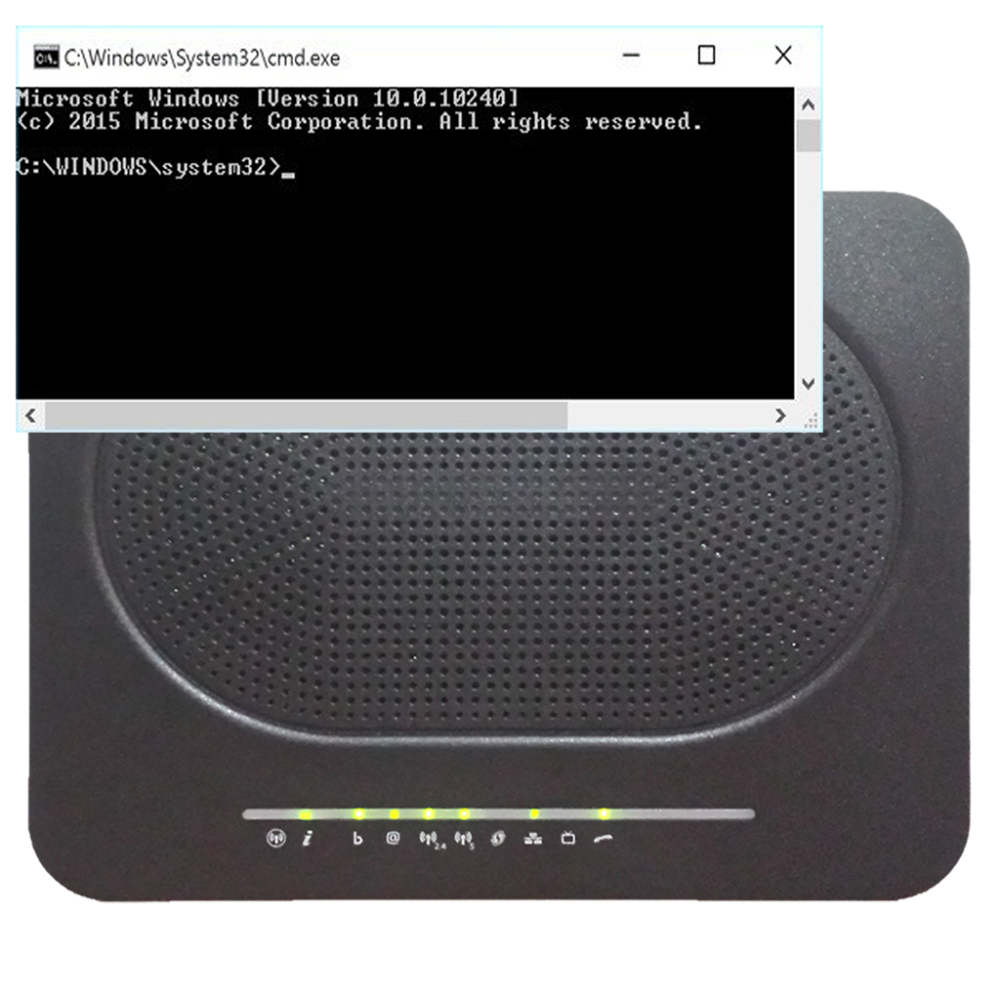

# TechniWAN
<TABLE><TR><TD>

 

<TABLE BORDER=0>
<TR>
<TD ALIGN=CENTER>  Windows 10 </TD>
<TD ALIGN=CENTER>  Windows 11 </TD>
</TR>
</TABLE>

## A small Windows program to quickly change WAN IP on Technicolor modems
Actually tested on: 
Technicolor DGA4331 
Technicolor DGA4130 
    
## Getting started
Get the last release clicking on the **Releases** button located on the **GitHUB** right panel 
or just click [here](https://github.com/uomoukko/TechniWAN/releases/). It's free for *personal use* 

# Prerequisites
Windows operating system only   

## Running the executables
 **desktop mode:** 
Double clicking the TechniWAN icon *shows the current IP* 
Dropping any file on TechniWAN icon *triggers the IP-change* 
*(press PAUSE to block countdown to window close)*

 **cmd mode:** 
C:\Users\Myname\Desktop>**TechniWAN** 
    *shows the current IP, doesn't change it* 
C:\Users\Myname\Desktop>**TechniWAN** anything 
    *triggers the IP-change* 

 **other options (cmd mode):** 
C:\Users\Myname\Desktop>**TechniWAN** -uuser -ppassword
    *sets user,password to save in register user,password* 
C:\Users\Myname\Desktop>**TechniWAN**  -R192.168.2.1 
    *sets router* 
C:\Users\Myname\Desktop>**TechniWAN** -x0 anything 
    *triggers the IP-change with no countdown*  

## Uses
SRP modem autentication 

## Built with
tdm-gcc (10.3.0) 

## Bugs
Please contact me for bugs/improvements 
</TD></TR></TD></TABLE>
